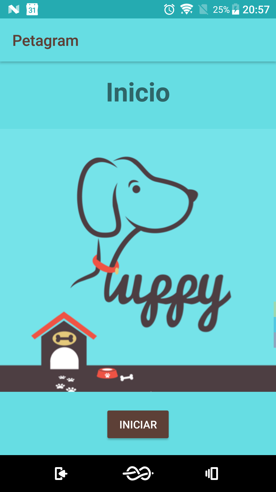
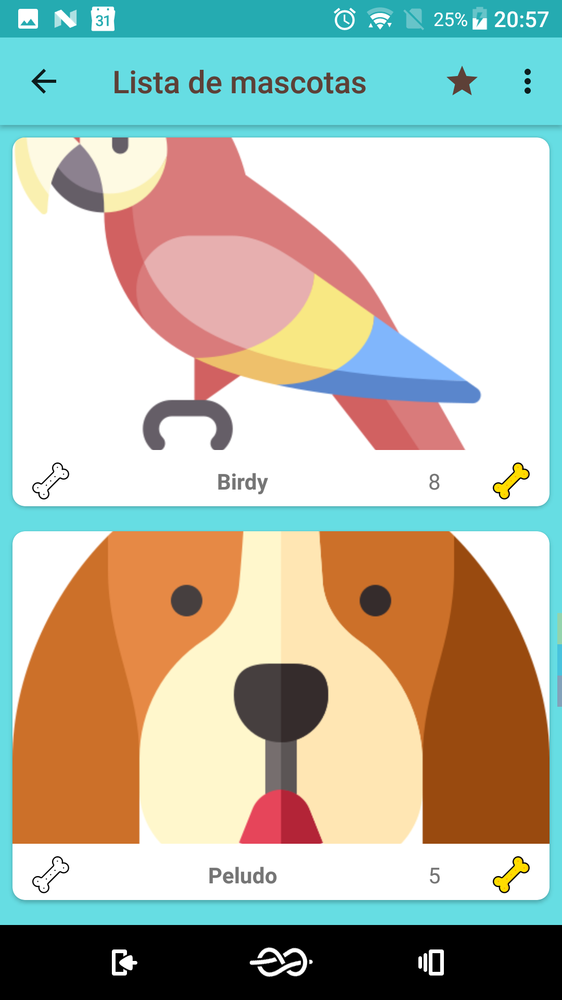
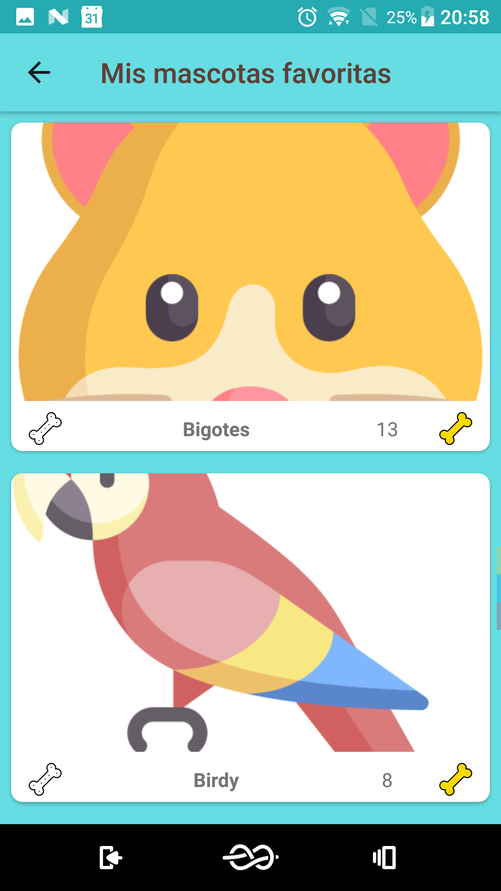

# Petagram
Semana 3 - Desarrollo de aplicaciones con Android - Coursera

Mascotas, RecyclerView y ActionView

Elaborado por IDBV

Este proyecto consiste en una aplicacion que muestra un listado de mascotas, utilizando RecyclerView,
Custom Adapter, ViewHolder, y un layout especifico para cada elemento de la lista, ademas implica un
flujo de tres actividades vinculadas por Actividad Padre-Hija y finalmente se aplica un CustomActionBar
utilizando Views con estilos de Material Design basandose en la [imagen de muestra](./app/src/main/res/drawable/img_home.png).

La aplicacion permite Calificar las mascotas y mostrar las 5 mejores apl presionar el boton de estrella
en el ActionBar

## Screenshots

